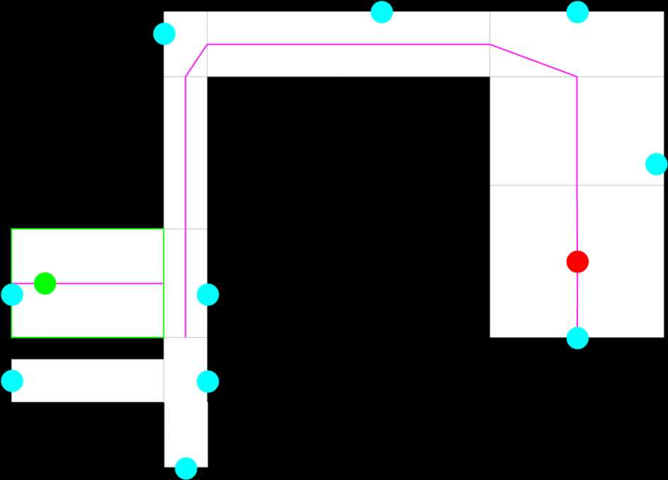

# BeaconBone

This project was developed for CSC 453: Software for Wireless Sensor System at
NC State University. Our group chose to design and implement an indoor
positioning system using Bluetooth beacons and BeagleBone Blacks.

[Developer Documentation](docs/documentation.md)

[Report](docs/report.md)

[Presentation](docs/presentation.pdf)

## Install

Installation should work on any Debian-based operating system.
Requires Bluetooth 3.0 support.

1. `git clone git@github.ncsu.edu:vtduong/BeaconBone.git`
2. `cd BeaconBone`
3. `./setup.sh`
4. `npm install`

## Run

### Publisher

`sudo coffee publisher.coffee brokerIP`

### MQTT Broker

`mosca -v | bunyan`

### HTTP Server

`sudo coffee server.coffee brokerIP`

## Contributors

* Matthew Hill
* Maxwell Johnson
* Van Duong
